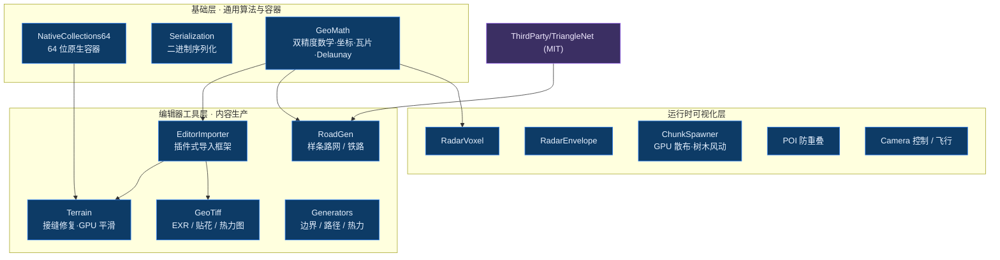

# UnityGeoToolkit

[English](README.en.md) · 个人技术积累仓库

   

UnityGeoToolkit 是一份面向 Unity 6000 的个人地理工具箱仓库，整理地理内容生产和运行时渲染中反复出现的基础能力：64 位原生容器、二进制序列化、双精度地理数学、编辑器导入框架、地形修复、道路生成、雷达体素和场景辅助工具。仓库定位是技术积累，不是完整业务平台；真实项目数据、内网端点、账号密钥、商业美术资源和业务流程壳都已移除或替换为占位说明。

## 架构



底层是通用容器与地理数学，向上支撑编辑器导入工具链与运行时可视化；`TriangleNet`（MIT）作为第三方三角化能力被路网生成复用。

## 亮点导航

| 模块 | 作用 | 关键技术 / 依赖 |
| --- | --- | --- |
| `NativeCollections64/` | 支持 `ulong` 长度的 `NativeArray64`、`NativeList64`、`UnsafeList64`，并提供 `IJobParallelFor64` 调度接口。 | Burst, unsafe collections, 64-bit indexing |
| `Serialization/` | 面向大体量缓存和瓦片数据的高性能二进制序列化工具，包含 unsafe 直存路径。 | Binary IO, unsafe write path |
| `GeoMath/` | 双精度向量、经纬度/墨卡托/瓦片行列号转换、瓦片 ID 和 Delaunay 基础算法。 | double precision, Web Mercator, Delaunay |
| `EditorImporter/` | 插件式编辑器导入框架，包含导入器骨架、通用窗口和文件/材质/瓦片坐标工具。 | Unity Editor, importer framework |
| `Terrain/` | 相邻地形瓦片接缝检测、修复和高度平滑。 | compute shader, seam fix |
| `RoadGen/` | 基于 Unity Splines 的道路/铁路网格生成、交叉口拼接和手绘道路工具。 | Unity Splines, Triangle.NET |
| `RadarVoxel/` 与 `RadarEnvelope/` | 雷达探测体素化和半球/扇形/环形扫描包络可视化。 | voxel mesh, scan envelope |
| `ChunkSpawner/`、`POI/`、`Camera/` | 分块散布、POI 防重叠、相机控制与飞行工具。 | GPU scatter, layout, camera rig |

## 预览

| 计划展示 | 文件名（放入 `docs/images/`） | 内容说明 |
| --- | --- | --- |
| 地形接缝修复 | `terrain-seamfix.gif` | 相邻瓦片接缝修复前后对比 |
| 路网生成 | `roadgen.gif` | 样条道路 / 交叉口网格生成 |
| 雷达包络 | `radar-envelope.gif` | 半球 / 扇形 / 环形扫描可视化 |
| 导入器 | `editor-importer.png` | 编辑器导入框架窗口截图 |

<!-- 补图后取消注释：
<p align="center">
  <br/>
  <em>图：地形接缝修复前后对比</em>
</p>
-->

## 目录结构

```text
UnityGeoToolkit/
├── NativeCollections64/  # 64 位 Burst 原生容器
├── Serialization/        # 二进制序列化
├── GeoMath/              # 双精度数学 / 坐标 / Delaunay
├── EditorImporter/       # 插件式编辑器导入框架
├── Terrain/              # 接缝修复 / GPU 平滑
├── RoadGen/              # 样条路网 / 铁路
├── GeoTiff/ Generators/  # GeoTiff 处理 / 几何生成
├── RadarVoxel/ RadarEnvelope/  # 雷达体素 / 扫描包络
├── ChunkSpawner/ POI/ Camera/  Utils/
├── ThirdParty/TriangleNet/     # Triangle.NET (MIT)
└── package.json
```

## 安装与依赖

1. 在 Unity Package Manager 中选择 `Add package from disk...`，指向本目录的 `package.json`。
2. 使用 Unity 6000 或兼容版本。
3. 安装 `package.json` 中声明的依赖，尤其是 `mathematics`、`burst`、`collections`、`newtonsoft-json` 和 `com.unity.splines`。
4. 本仓不包含真实地理数据或在线服务。示例建议从 `Samples~/README.md` 中的合成样条、合成瓦片和公开坐标开始。

## 使用建议

如果只想看核心亮点，建议先读 `NativeCollections64/` 和 `GeoMath/`。如果要搭建地理内容导入工具链，再从 `EditorImporter/`、`Terrain/` 和 `RoadGen/` 开始；雷达相关可从 `RadarVoxel/` 与 `RadarEnvelope/` 进入。

## 许可与脱敏

- 私有品牌命名、业务地名、真实坐标清单、内网地址、密钥和商业资源均已清理。
- `LICENSE` 仅覆盖本人原创和改写部分。
- Triangle.NET、Unity 官方包和 Newtonsoft Json 等第三方依赖按各自许可使用，详情见 `THIRD_PARTY_NOTICES.md`。
- 复核记录见 `脱敏复核报告.md`。

## 相关仓库

同一套地理三维工程经验的三个方向，可对照阅读：

- [CesiumforUnitySDK](https://github.com/zhuxb93/CesiumforUnitySDK) — Unity / C#，Cesium 生态下的矢量瓦片渲染与 GPU 实例化。
- **[UnityGeoToolkit](https://github.com/zhuxb93/UnityGeoToolkit)** — Unity / C#，地理编辑器导入框架与地形 / 路网 / 雷达工具链。
- [CesiumforUnrealSDK](https://github.com/zhuxb93/CesiumforUnrealSDK) — Unreal / C++，地球相机与矢量瓦片插件。

对照点：矢量瓦片渲染（Unity C# ↔ Unreal C++ 双实现）；地理坐标数学（`GeoMath` ↔ `CoordinateConverter`）；相机运镜（关键帧录播 ↔ 地球相机控制器）。

## 当前状态

本仓已完成模块抽取、中文模块说明、英文同步文档、第三方许可清单和脱敏复核。尚未在 Unity Editor 中完成真实导入编译，公开使用前建议先在 Unity 6000 工程中跑一轮本地包导入验证。
