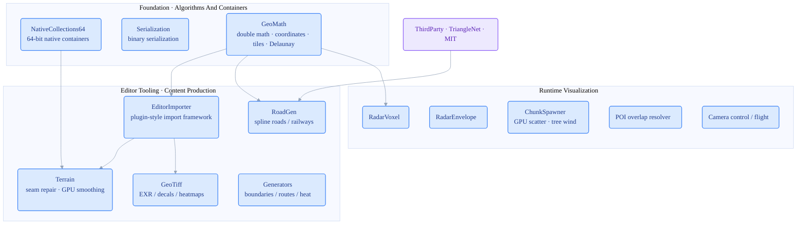

# UnityGeoToolkit

[中文](README.zh-CN.md) · personal portfolio

   

UnityGeoToolkit is a personal geospatial toolkit archive for Unity 6000. It collects reusable building blocks for geospatial content production and runtime visualization: 64-bit native containers, binary serialization, double-precision geospatial math, editor import frameworks, terrain repair, road generation, radar voxelization, and scene utilities. It is a technical archive rather than a complete business platform.

## Architecture



The foundation layer provides reusable containers and geospatial math, which support editor import workflows and runtime visualization. `TriangleNet` (MIT) is vendored as the triangulation dependency reused by road generation.

## Highlights

| Module | Role | Key Technology / Dependency |
| --- | --- | --- |
| `NativeCollections64/` | `NativeArray64`, `NativeList64`, and `UnsafeList64` with `ulong` length support plus `IJobParallelFor64`. | Burst, unsafe collections, 64-bit indexing |
| `Serialization/` | High-performance binary serialization for large caches and tile-like data, including unsafe direct-write paths. | Binary IO, unsafe write path |
| `GeoMath/` | Double-precision vectors, lon/lat, Web Mercator, tile row/column conversion, tile IDs, and Delaunay basics. | double precision, Web Mercator, Delaunay |
| `EditorImporter/` | Plugin-style editor import framework with importer skeletons, windows, and file/material/tile-coordinate utilities. | Unity Editor, importer framework |
| `Terrain/` | Detection, repair, and smoothing for seams between adjacent terrain tiles. | compute shader, seam fix |
| `RoadGen/` | Unity Splines based road and railway mesh generation, intersection stitching, and hand-drawn tools. | Unity Splines, Triangle.NET |
| `RadarVoxel/` and `RadarEnvelope/` | Radar detection voxelization and hemisphere/fan/ring scan-envelope visualization. | voxel mesh, scan envelope |
| `ChunkSpawner/`, `POI/`, `Camera/` | Chunked object spawning, POI overlap resolution, and camera flight utilities. | GPU scatter, layout, camera rig |

## Preview

| Planned View | File Name (place in `docs/images/`) | Description |
| --- | --- | --- |
| Terrain seam repair | `terrain-seamfix.gif` | Before/after comparison for adjacent terrain seams |
| Road generation | `roadgen.gif` | Spline roads and intersection mesh generation |
| Radar envelope | `radar-envelope.gif` | Hemisphere, fan, and ring scan visualization |
| Importer | `editor-importer.png` | Editor import framework window screenshot |

<!-- Uncomment after adding media:
<p align="center">
  <br/>
  <em>Figure: before/after comparison for terrain seam repair</em>
</p>
-->

## Directory Structure

```text
UnityGeoToolkit/
├── NativeCollections64/  # 64-bit Burst native containers
├── Serialization/        # binary serialization
├── GeoMath/              # double math / coordinates / Delaunay
├── EditorImporter/       # plugin-style editor import framework
├── Terrain/              # seam repair / GPU smoothing
├── RoadGen/              # spline roads / railways
├── GeoTiff/ Generators/  # GeoTiff processing / geometry generation
├── RadarVoxel/ RadarEnvelope/  # radar voxel / scan envelope
├── ChunkSpawner/ POI/ Camera/  Utils/
├── ThirdParty/TriangleNet/     # Triangle.NET (MIT)
└── package.json
```

## Installation And Dependencies

1. In Unity Package Manager, choose `Add package from disk...` and select this repository's `package.json`.
2. Use Unity 6000 or a compatible version.
3. Install the dependencies declared in `package.json`, especially `mathematics`, `burst`, `collections`, `newtonsoft-json`, and `com.unity.splines`.
4. This repository does not include real geospatial data or online services. Start with the synthetic splines, synthetic tiles, and public-coordinate examples described in `Samples~/README.md`.

## Usage Notes

If you only want the core technical pieces, start with `NativeCollections64/` and `GeoMath/`. If you are building a geospatial content import pipeline, continue with `EditorImporter/`, `Terrain/`, and `RoadGen/`; radar-related modules start at `RadarVoxel/` and `RadarEnvelope/`.

## Licensing And Sanitization

- Private brand names, business place names, real coordinate lists, internal URLs, credentials, and commercial assets have been removed.
- `LICENSE` only covers original or rewritten code in this repository.
- Triangle.NET, Unity packages, and Newtonsoft Json remain governed by their own licenses. See `THIRD_PARTY_NOTICES.md`.
- See `脱敏复核报告.md` for the sanitization review.

## Related Repositories

These three repositories describe different directions of the same geospatial 3D engineering experience:

- [CesiumforUnitySDK](https://github.com/zhuxb93/CesiumforUnitySDK) — Unity / C#, vector-tile rendering and GPU instancing in the Cesium ecosystem.
- **[UnityGeoToolkit](https://github.com/zhuxb93/UnityGeoToolkit)** — Unity / C#, geospatial editor import framework plus terrain / road / radar tooling.
- [CesiumforUnrealSDK](https://github.com/zhuxb93/CesiumforUnrealSDK) — Unreal / C++, globe camera and vector-tile plugin.

Comparison points: vector-tile rendering (Unity C# ↔ Unreal C++); geospatial coordinate math (`GeoMath` ↔ `CoordinateConverter`); camera motion (keyframe playback ↔ globe camera controller).

## Current Status

The module extraction, Chinese module notes, synchronized English README, third-party notices, and sanitization review are complete. The package has not yet been imported and compiled in Unity Editor; run a Unity 6000 local package import before production use.
